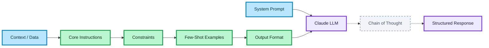
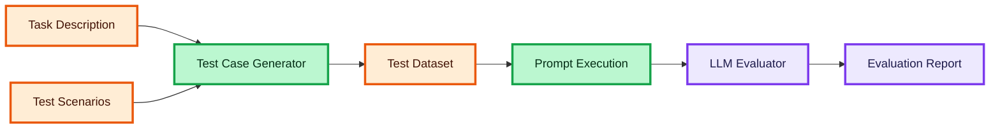

# Prompt Engineering Flow & Use Cases

This page explains the detailed flow of crafting effective prompts, the key takeaways from prompt engineering, and common use cases.
The goal is to separate instructions, context, constraints, and formatting to ensure the LLM understands the exact requirements and produces predictable results.

## System Prompt (Role)

The System Prompt sets the foundational behavior and boundaries for the model.
It defines the persona, tone, and global rules (like a director telling an actor their character background before the scene begins).
**Why:** establishing a persona immediately narrows the vocabulary and scope of the model's responses.

## Context (Background Data)

The Context provides the necessary background information or raw data the model needs to process.
It is best separated using XML tags like `<context>` or `<document>` (like giving a lawyer a folder of evidence before asking them to argue a case).
**Why:** clear separation of context prevents the model from confusing instructions with data.

## Instructions (Core Task)

The Instructions define the specific goal the model must achieve.
They should be clear, direct, and imperative (like a general giving precise orders to a squad).
**Why:** ambiguity in instructions leads to hallucinations or unexpected behavior.

## Constraints (Rules)

The Constraints define what the model must NOT do, or strict limits it must follow.
This includes tone restrictions, length limits, or forbidden topics (like drawing lines on a field that a player cannot cross).
**Why:** constraints filter out unwanted generation paths and keep the output focused.

## Few-Shot Examples (Format Guidance)

Examples demonstrate the desired input-output mapping.
They show the model exactly what success looks like (like showing an apprentice a finished carving before they start their own).
**Why:** examples are often more effective at enforcing output structures than paragraphs of instructions.

## Chain of Thought (Reasoning)

Chain of Thought requires the model to explain its logic step-by-step before delivering the final answer.
It is often wrapped in `<thinking>` tags (like forcing a student to show their math work before writing the final number).
**Why:** forcing sequential reasoning drastically reduces logical errors and hallucinations.

## Output Structure (Indicators)

The Output Structure defines the exact format the final response must take, such as JSON, XML, or Markdown.
Starting the assistant's response with a predefined tag like `{` or ````json` ensures immediate compliance (like handing someone a specific pre-printed form to fill out).
**Why:** consistent structure is mandatory when integrating LLM outputs into software systems.

---

## Use Cases

### Data Extraction & Formatting

Extracting structured data from unstructured text.  
*Example:* Pulling patient symptoms and diagnoses from a medical transcript into a strict JSON schema.

### Classification & Routing

Categorizing inputs based on predefined rules.  
*Example:* Analyzing customer support emails and routing them to "Billing", "Technical", or "Refund" queues.

### Constrained Generation

Writing content under strict rules and constraints.  
*Example:* Generating a 1-day meal plan that strictly adheres to a caloric limit and specific food allergies without adding filler text.

### Complex Reasoning & QA

Answering questions based on large, complex documents using logic.  
*Example:* Summarizing financial risks from a 50-page legal contract using Chain of Thought to ensure no clauses are missed.

---

## Architecture Flow: Prompt Construction



## Architecture Flow: Prompt Evaluation (Evals)



### 🎨 Legend

#### Node colors

| Color | Meaning |
| :--- | :--- |
| 🔵 **Blue** | Inputs / User-provided Context |
| 🟣 **Purple** | Server / External LLM API |
| 🟢 **Green** | Processing / Prompt Rules |
| 🟠 **Orange** | Datasets / Stored State |
| ⚪ **Gray (pale, dashed border)** | Hidden / Internal Model Reasoning |

#### Edge types

| Edge | Meaning |
| :--- | :--- |
| `——→` solid | Core flow — critical path |
| `- - →` dashed | Internal reasoning / generation step |
