# RAG & LLM Algorithms — Reference

> The core algorithms behind retrieval, ranking, and prompting in a RAG system.

---

## Overview map

| Category | Algorithm | What it does |
| :--- | :--- | :--- |
| Vector search | kNN / cosine similarity | Find chunks closest in meaning |
| ANN index | HNSW, IVF, PQ | Make vector search fast at scale |
| Lexical search | BM25 | Match exact keywords, not meaning |
| Fusion | Hybrid search (RRF) | Combine lexical + semantic |
| Ranking | Reranking (cross-encoder) | Re-score top-N for true relevance |
| Prompting | RAG, CoT, ReAct, Self-consistency | Shape how the model reasons |

---

## Vector search: k-Nearest Neighbors (the foundation)

Two distinct players take part in answering a query.

| Player | Role |
| :--- | :--- |
| **Voyage AI (embedding model)** | Turns text into a vector. Nothing else. |
| **Vector database / search algorithm** | Takes the query vector and finds the nearest chunk vectors. |

Voyage does **not** search. It only "places points in space." Finding the nearest points is solved by the **k-Nearest Neighbors (kNN)** algorithm.

The flow: every chunk is embedded ahead of time into a "cloud of points"; the query is embedded into one new point; we return the **k nearest** chunk-points as context for the model.

---

## Cosine similarity: how "closeness" is measured

RAG almost always uses **cosine similarity** — it looks at the **angle** between vectors, not their length. We care about the *direction of meaning*, not the "strength" of the text. A long and a short text about the same thing point the same way.

```text
             A · B            Σ aᵢ·bᵢ
cos(θ) = ────────────── = ───────────────────
          ‖A‖ · ‖B‖       √(Σ aᵢ²) · √(Σ bᵢ²)
```

- `A · B` — the dot product (multiply coordinate-wise, then sum).
- `‖A‖` — the length of the vector (its norm).
- Range **[-1, 1]**: `1` = identical direction (most similar), `0` = unrelated, `-1` = opposite.

The **higher** the cosine similarity, the **closer** the chunk.

---

## Process diagram

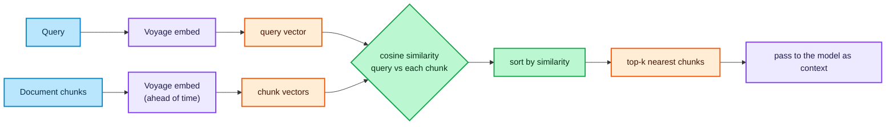

### Legend

| Color | Meaning |
| :--- | :--- |
| 🔵 Blue | Client / input — the raw query and the document chunks |
| 🟣 Purple | Infrastructure — the Voyage embedding service and the LLM |
| 🟠 Orange | Data — the vectors and the retrieved top-k chunks |
| 🟢 Green | Logic — similarity scoring and ranking |

---

## Brute-force kNN in Python

"Brute-force" means we compare the query against **every** chunk. Exact; slow only on large collections.

```python
import numpy as np


def cosine_similarity(a, b):
    """Cosine similarity of two vectors: a value in [-1, 1]."""
    a, b = np.asarray(a, dtype=float), np.asarray(b, dtype=float)
    return np.dot(a, b) / (np.linalg.norm(a) * np.linalg.norm(b))


def find_top_k(query_vec, chunk_vecs, k=3):
    """Return the k chunks closest to the query, most similar first."""
    scored = [
        (i, cosine_similarity(query_vec, chunk_vec))
        for i, chunk_vec in enumerate(chunk_vecs)
    ]
    scored.sort(key=lambda pair: pair[1], reverse=True)
    return scored[:k]
```

---

## Exact kNN vs approximate (ANN)

Brute-force computes similarity against **all** vectors — `O(n)` per query. With millions of chunks this is too slow, so we switch to **Approximate Nearest Neighbors (ANN)**: trade a sliver of accuracy for huge speed.

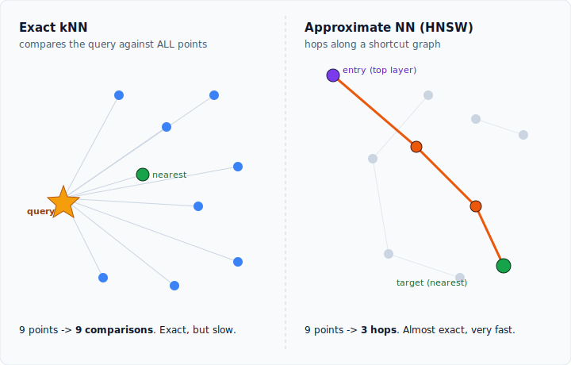

| | Brute-force kNN | ANN (HNSW) |
| :--- | :--- | :--- |
| Accuracy | 100% | ~95–99% |
| Speed | slow on large data | very fast |
| When to use | up to ~10k vectors, learning | production, millions of vectors |

### ANN index family

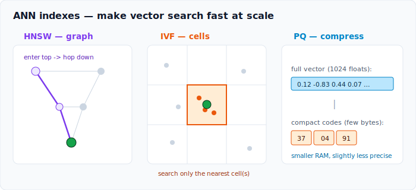

- **HNSW** (Hierarchical Navigable Small World) — a graph of "shortcut links"; hop to neighbors in a few steps. Default in Chroma / Pinecone.
- **IVF** (Inverted File) — partitions the space into "cells/clusters"; search only the few nearest cells.
- **PQ** (Product Quantization) — compresses vectors into compact codes to save memory; often combined with IVF (`IVF-PQ`).

| Index | Idea | Trades |
| :--- | :--- | :--- |
| HNSW | graph navigation | high memory, top recall/speed |
| IVF | cluster bucketing | tune cells vs accuracy |
| PQ | vector compression | smaller RAM, lower precision |

---

## Lexical search: BM25

BM25 matches **exact terms**, not meaning. It is the modern standard for keyword search (sparse, term-frequency based). It shines exactly where embeddings blur: codes, IDs, names like `ERR_MEM_ALLOC_FAIL_0x8007000E` or `XDR-471`.

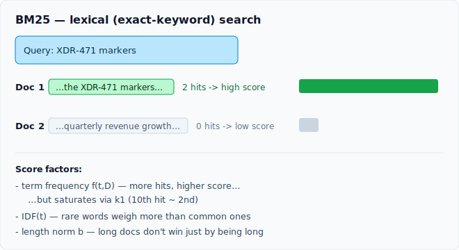

```text
                       f(t,D) · (k1 + 1)
score(D,Q) = Σ IDF(t) · ─────────────────────────────────────
             t∈Q         f(t,D) + k1 · (1 - b + b · |D|/avgdl)

IDF(t) = ln( 1 + (N - n(t) + 0.5) / (n(t) + 0.5) )
```

- `f(t,D)` — how often term `t` appears in document `D` (term frequency).
- `IDF(t)` — rare terms across the corpus weigh more; common words weigh less.
- `k1` (~1.2–2.0) — term-frequency **saturation**: the 10th occurrence adds little over the 2nd.
- `b` (~0.75) — **length normalization**: long documents do not win just by being long.
- `N` — total docs; `n(t)` — docs containing `t`; `avgdl` — average document length.

Covered hands-on in `004_bm25.ipynb` and `005_hybrid.ipynb`.

| | BM25 (lexical) | Vector search (semantic) |
| :--- | :--- | :--- |
| Matches | exact words / tokens | meaning / paraphrase |
| Strong at | IDs, codes, rare names | synonyms, intent |
| Blind to | synonyms, rewording | exact rare tokens |

---

## Hybrid search

Lexical and semantic search fail in opposite ways, so combine both and **fuse** their ranked lists. The standard fusion is **Reciprocal Rank Fusion (RRF)** — it merges by rank position, not raw scores (which live on different scales).

```text
RRF(d) = Σ  1 / (k + rankᵣ(d))          k ≈ 60
         r

rankᵣ(d) = position of document d in result list r (BM25 list, vector list, ...)
```

A document ranked high in **either** list gets a strong combined score; ranked high in **both**, even stronger.

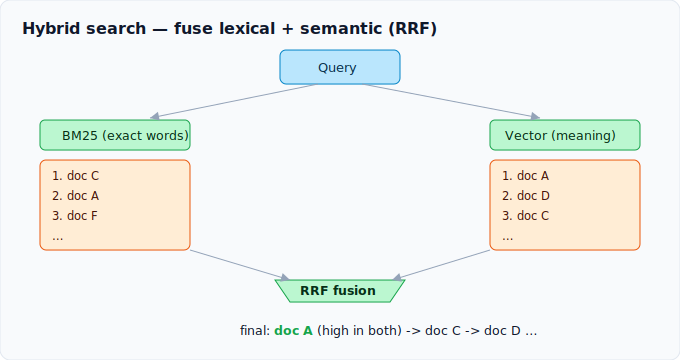

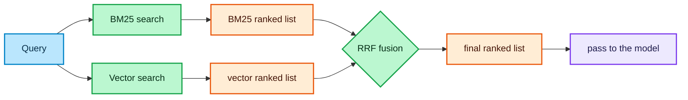

### Legend 2

| Color | Meaning |
| :--- | :--- |
| 🔵 Blue | Input — the raw query |
| 🟢 Green | Logic — the two searchers and the RRF fusion step |
| 🟠 Orange | Data — the ranked lists and the fused result |
| 🟣 Purple | Infrastructure — the LLM that consumes the context |

---

## Reranking

Retrieval is fast but rough. Reranking adds a **second, slower, smarter pass** over only the top-N candidates.

The key distinction:

- **Bi-encoder** (what Voyage does) — embeds query and document **separately**, then compares vectors. Fast, can pre-compute, but never sees them together.
- **Cross-encoder** (the reranker) — feeds query **and** document **together** into one model and outputs a relevance score. Slow, cannot pre-compute, but far more accurate.

So: retrieve top-100 cheaply with a bi-encoder/BM25, then rerank to top-5 with a cross-encoder (e.g. `voyage-rerank`, `cohere-rerank`).

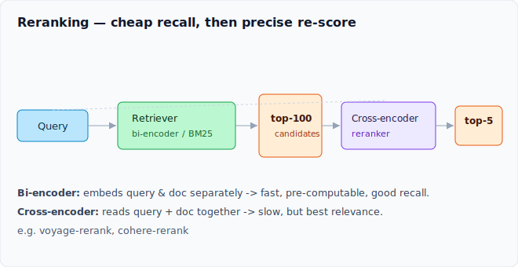

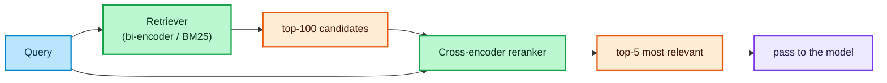

### Legend 3

| Color | Meaning |
| :--- | :--- |
| 🔵 Blue | Input — the raw query |
| 🟢 Green | Logic — the fast retriever and the cross-encoder reranker |
| 🟠 Orange | Data — candidate set and final top-5 |
| 🟣 Purple | Infrastructure — the LLM |

| | Bi-encoder (retriever) | Cross-encoder (reranker) |
| :--- | :--- | :--- |
| Input | query and doc separately | query and doc together |
| Speed | fast, pre-computable | slow, per-pair |
| Accuracy | good | best |
| Role | get top-100 | pick top-5 |

---

## Prompting strategies (algorithms too)

Beyond retrieval, the way we drive the model is itself algorithmic.

- **RAG** — retrieve relevant context, then generate grounded in it. The whole pipeline above.
- **Chain-of-Thought (CoT)** — ask the model to reason step by step before answering; improves multi-step problems.
- **ReAct** — interleave **Reason** and **Act** (tool calls) in a loop; the foundation of agents.
- **Self-consistency** — sample several CoT answers, then take the majority vote.

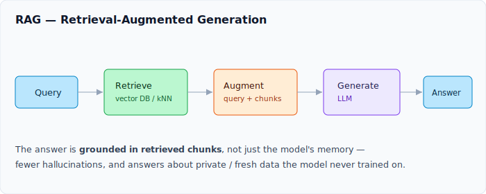

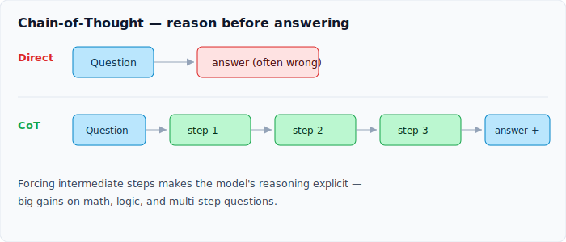

The ReAct loop:

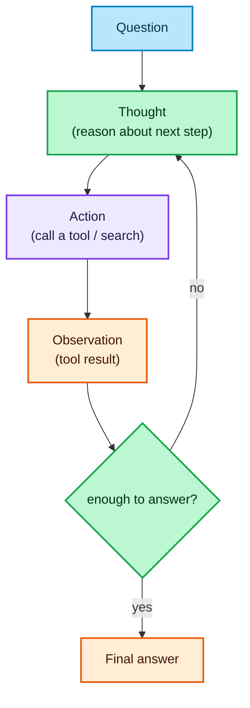

### Legend 4

| Color | Meaning |
| :--- | :--- |
| 🔵 Blue | Input — the user question |
| 🟢 Green | Logic — reasoning and the stop/continue decision |
| 🟣 Purple | Infrastructure — the tool / action call |
| 🟠 Orange | Data — observations and the final answer |

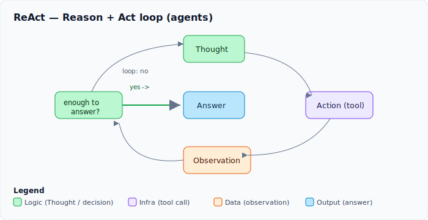

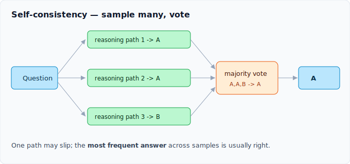

---

## Master comparison

| Algorithm | Type | Matches on | Speed | Best for |
| :--- | :--- | :--- | :--- | :--- |
| Vector kNN | retrieval | meaning | medium | semantic recall |
| HNSW / IVF / PQ | index | meaning | fast | scaling vector search |
| BM25 | retrieval | exact terms | fast | IDs, codes, names |
| Hybrid (RRF) | fusion | both | fast | general-purpose RAG |
| Reranking | ranking | query+doc together | slow | precision on top-N |
| CoT / ReAct / Self-consistency | prompting | n/a | varies | reasoning, agents |
