# Алгоритми RAG та LLM — Довідник

> Основні алгоритми, що лежать в основі пошуку (retrieval), ранжирування (ranking) та промптингу (prompting) у системі RAG.

---

## Оглядова карта

| Категорія | Алгоритм | Що він робить |
| :--- | :--- | :--- |
| Векторний пошук | kNN / косинусна подібність | Знаходить найближчі за змістом фрагменти (chunks) |
| ANN індекс | HNSW, IVF, PQ | Робить векторний пошук швидким на великих масштабах |
| Лексичний пошук | BM25 | Шукає точні збіги ключових слів, а не зміст |
| Злиття (Fusion) | Гібридний пошук (RRF) | Поєднує лексичний та семантичний пошук |
| Ранжирування | Переранжирування (cross-encoder) | Переоцінює топ-N для визначення справжньої релевантності |
| Промптинг | RAG, CoT, ReAct, Self-consistency | Визначає, як модель міркує |

---

## Векторний пошук: k-найближчих сусідів (kNN) (основа)

У відповіді на запит беруть участь два різні гравці.

| Гравець | Роль |
| :--- | :--- |
| **Voyage AI (модель ембедингу)** | Перетворює текст у вектор. Більше нічого. |
| **Векторна база даних / алгоритм пошуку** | Бере вектор запиту і знаходить найближчі вектори фрагментів. |

Voyage **не** виконує пошук. Він лише "розміщує точки у просторі". Пошук найближчих точок вирішується алгоритмом **k-найближчих сусідів (kNN)**.

Потік дій: кожен фрагмент заздалегідь перетворюється на вектор і стає "хмарою точок"; запит перетворюється на одну нову точку; ми повертаємо **k найближчих** точок-фрагментів як контекст для моделі.

---

## Косинусна подібність (Cosine similarity): як вимірюється "близькість"

RAG майже завжди використовує **косинусну подібність** — вона дивиться на **кут** між векторами, а не на їхню довжину. Нас цікавить *напрямок змісту*, а не "сила" тексту. Довгий і короткий текст про одне й те саме вказують в одному напрямку.

```text
             A · B            Σ aᵢ·bᵢ
cos(θ) = ────────────── = ───────────────────
          ‖A‖ · ‖B‖       √(Σ aᵢ²) · √(Σ bᵢ²)
```

- `A · B` — скалярний добуток (перемножуємо координати, потім додаємо).
- `‖A‖` — довжина вектора (його норма).
- Діапазон **[-1, 1]**: `1` = однаковий напрямок (найбільш подібні), `0` = не пов'язані, `-1` = протилежні.

Чим **вища** косинусна подібність, тим **ближчий** фрагмент.

---

## Діаграма процесу

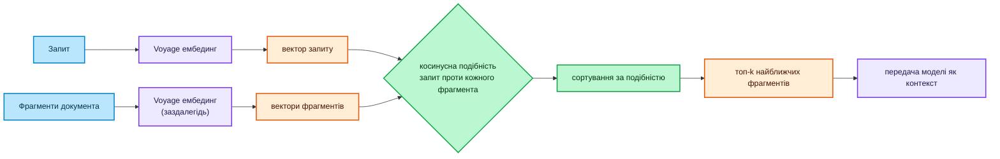

### Легенда

| Колір | Значення |
| :--- | :--- |
| 🔵 Синій | Клієнт / вхідні дані — сирий запит та фрагменти документа |
| 🟣 Фіолетовий | Інфраструктура — сервіс ембедингів Voyage та LLM |
| 🟠 Помаранчевий | Дані — вектори та отримані топ-k фрагментів |
| 🟢 Зелений | Логіка — оцінка подібності та ранжирування |

---

## Прямий (Brute-force) kNN на Python

"Прямий метод" (Brute-force) означає, що ми порівнюємо запит із **кожним** фрагментом. Він точний; повільний лише на великих колекціях.

```python
import numpy as np


def cosine_similarity(a, b):
    """Косинусна подібність двох векторів: значення у діапазоні [-1, 1]."""
    a, b = np.asarray(a, dtype=float), np.asarray(b, dtype=float)
    return np.dot(a, b) / (np.linalg.norm(a) * np.linalg.norm(b))


def find_top_k(query_vec, chunk_vecs, k=3):
    """Повертає k фрагментів, найближчих до запиту (найподібніші спочатку)."""
    scored = [
        (i, cosine_similarity(query_vec, chunk_vec))
        for i, chunk_vec in enumerate(chunk_vecs)
    ]
    scored.sort(key=lambda pair: pair[1], reverse=True)
    return scored[:k]
```

---

## Точний kNN проти наближеного (ANN)

Прямий пошук (Brute-force) обчислює подібність з **усіма** векторами — `O(n)` на запит. З мільйонами фрагментів це занадто повільно, тому ми переходимо до **Approximate Nearest Neighbors (ANN)**: жертвуємо дрібкою точності заради величезної швидкості.

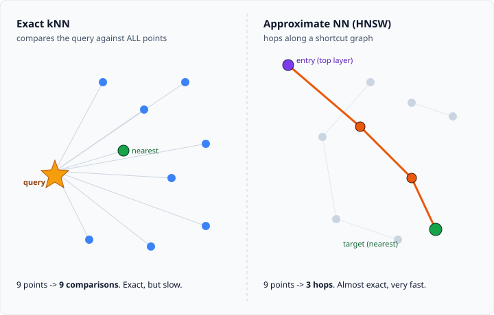

| | Прямий kNN | ANN (HNSW) |
| :--- | :--- | :--- |
| Точність | 100% | ~95–99% |
| Швидкість | повільно на великих даних | дуже швидко |
| Коли використовувати | до ~10k векторів, навчання | продакшн, мільйони векторів |

### Родина індексів ANN

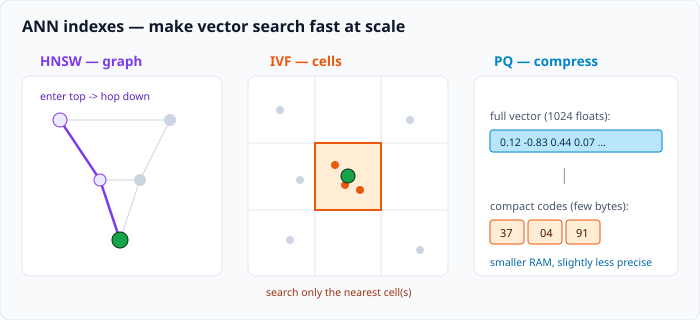

- **HNSW** (Hierarchical Navigable Small World) — граф "швидких зв'язків"; перехід до сусідів за кілька кроків. За замовчуванням у Chroma / Pinecone.
- **IVF** (Inverted File) — розбиває простір на "комірки/кластери"; пошук лише в кількох найближчих комірках.
- **PQ** (Product Quantization) — стискає вектори в компактні коди для економії пам'яті; часто поєднується з IVF (`IVF-PQ`).

| Індекс | Ідея | Компроміси |
| :--- | :--- | :--- |
| HNSW | навігація по графу | високе споживання пам'яті, найкраща повнота/швидкість |
| IVF | розбиття на кластери | налаштування кількості комірок проти точності |
| PQ | стиснення векторів | менша оперативна пам'ять, нижча точність |

---

## Лексичний пошук: BM25

BM25 знаходить **точні терміни**, а не зміст. Це сучасний стандарт для пошуку за ключовими словами (розріджений, на основі частоти термінів). Він блискуче працює саме там, де ембединги дають збій: коди, ID, специфічні назви типу `ERR_MEM_ALLOC_FAIL_0x8007000E` або `XDR-471`.

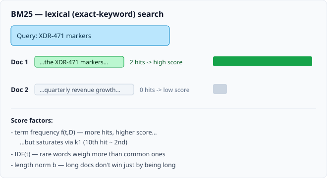

```text
                        f(t,D) · (k1 + 1)
score(D,Q) = Σ IDF(t) · ─────────────────────────────────────
             t∈Q         f(t,D) + k1 · (1 - b + b · |D|/avgdl)

IDF(t) = ln( 1 + (N - n(t) + 0.5) / (n(t) + 0.5) )
```

- `f(t,D)` — як часто термін `t` зустрічається в документі `D` (частота терміну).
- `IDF(t)` — рідкісні терміни в корпусі мають більшу вагу; загальновживані слова важать менше.
- `k1` (~1.2–2.0) — **насичення** частоти терміну: 10-та поява додає небагато у порівнянні з 2-ю.
- `b` (~0.75) — **нормалізація довжини**: довгі документи не виграють лише через свою довжину.
- `N` — загальна кількість документів; `n(t)` — документи, що містять `t`; `avgdl` — середня довжина документа.

Практично розглядається в `004_bm25.ipynb` та `005_hybrid.ipynb`.

| | BM25 (лексичний) | Векторний пошук (семантичний) |
| :--- | :--- | :--- |
| Знаходить | точні слова / токени | зміст / перефразування |
| Сильний у | ID, коди, рідкісні назви | синоніми, наміри |
| Сліпий до | синонімів, зміни формулювань | точних рідкісних токенів |

---

## Гібридний пошук

Лексичний та семантичний пошук помиляються по-різному, тому варто об'єднати обидва та **злити (fuse)** їхні відсортовані списки. Стандартним методом злиття є **Reciprocal Rank Fusion (RRF)** — він об'єднує за позицією в рейтингу, а не за сирими балами (які знаходяться в різних шкалах).

```text
RRF(d) = Σ  1 / (k + rankᵣ(d))          k ≈ 60
         r

rankᵣ(d) = позиція документа d у списку результатів r (список BM25, список векторів, ...)
```

Документ, який займає високу позицію в **будь-якому** зі списків, отримує сильний комбінований бал; якщо ж він високо в **обох** — ще сильніший.

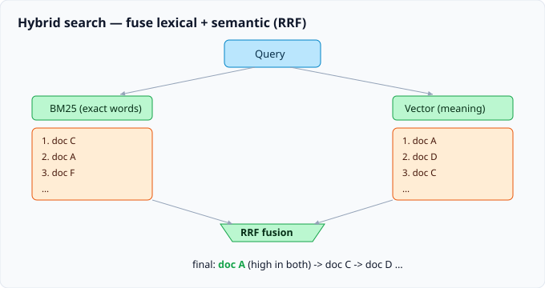

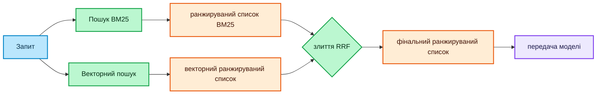

### Легенда 2

| Колір | Значення |
| :--- | :--- |
| 🔵 Синій | Вхідні дані — сирий запит |
| 🟢 Зелений | Логіка — два пошуковики та етап злиття RRF |
| 🟠 Помаранчевий | Дані — ранжирувані списки та об'єднаний результат |
| 🟣 Фіолетовий | Інфраструктура — LLM, яка споживає контекст |

---

## Переранжирування (Reranking)

Пошук швидкий, але грубий. Переранжирування додає **другий, повільніший та розумніший прохід** лише для топ-N кандидатів.

Ключова відмінність:

- **Bi-encoder** (те, що робить Voyage) — створює ембединги запиту та документа **окремо**, а потім порівнює вектори. Швидко, можна обчислити заздалегідь, але вони ніколи не "бачать" один одного разом.
- **Cross-encoder** (реранкер) — передає запит **і** документ **разом** в одну модель і видає оцінку релевантності. Повільно, неможливо обчислити заздалегідь, але набагато точніше.

Отже: дешево отримуємо топ-100 за допомогою bi-encoder/BM25, а потім переранжируємо їх до топ-5 за допомогою cross-encoder (наприклад, `voyage-rerank`, `cohere-rerank`).

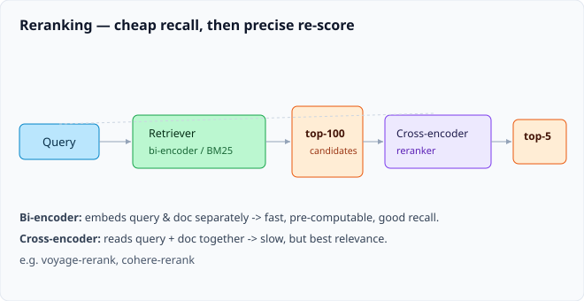

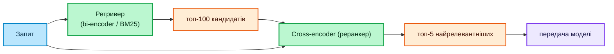

### Легенда 3

| Колір | Значення |
| :--- | :--- |
| 🔵 Синій | Вхідні дані — сирий запит |
| 🟢 Зелений | Логіка — швидкий ретривер та cross-encoder реранкер |
| 🟠 Помаранчевий | Дані — набір кандидатів та фінальні топ-5 |
| 🟣 Фіолетовий | Інфраструктура — LLM |

| | Bi-encoder (ретривер) | Cross-encoder (реранкер) |
| :--- | :--- | :--- |
| Вхідні дані | запит і документ окремо | запит і документ разом |
| Швидкість | швидко, можна обчислити заздалегідь | повільно, для кожної пари |
| Точність | хороша | найкраща |
| Роль | отримати топ-100 | вибрати топ-5 |

---

## Стратегії промптингу (теж алгоритми)

Крім пошуку, спосіб, яким ми керуємо моделлю, сам по собі є алгоритмічним.

- **RAG** — знайти релевантний контекст, а потім згенерувати відповідь на його основі. Це весь описаний вище пайплайн.
- **Chain-of-Thought (CoT)** (Ланцюжок міркувань) — просимо модель міркувати крок за кроком перед тим, як дати відповідь; покращує вирішення багатоетапних задач.
- **ReAct** (Reason + Act) — чергування **Міркування** та **Дії** (виклику інструментів) у циклі; основа агентів.
- **Self-consistency** (Самоузгодженість) — генерування кількох відповідей з CoT, а потім вибір тієї, що зустрічається найчастіше (голосування більшості).

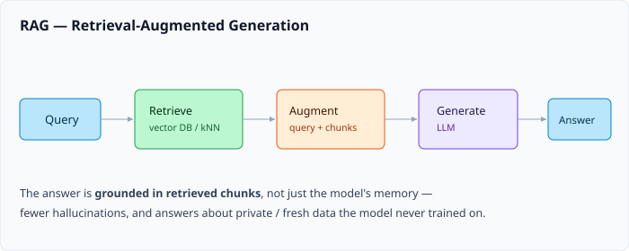

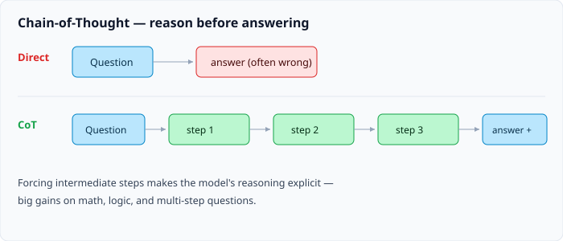

Цикл ReAct:

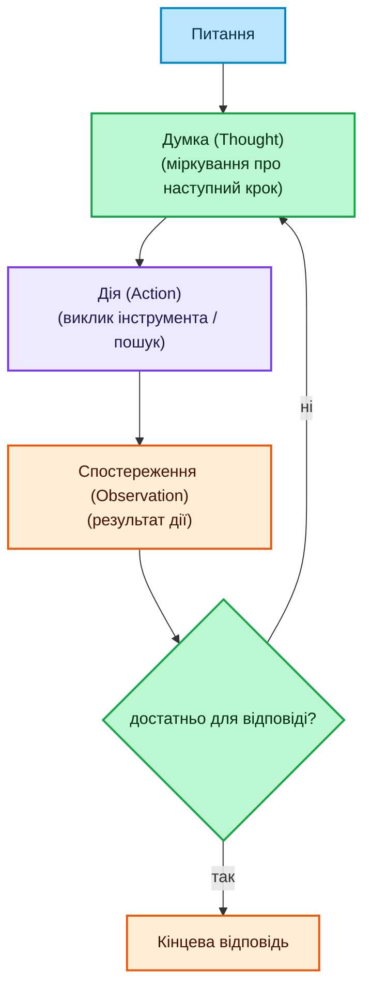

### Легенда 4

| Колір | Значення |
| :--- | :--- |
| 🔵 Синій | Вхідні дані — питання користувача |
| 🟢 Зелений | Логіка — міркування та рішення про зупинку/продовження |
| 🟣 Фіолетовий | Інфраструктура — виклик інструмента / дії |
| 🟠 Помаранчевий | Дані — спостереження та кінцева відповідь |

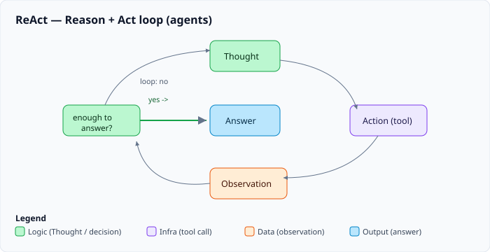

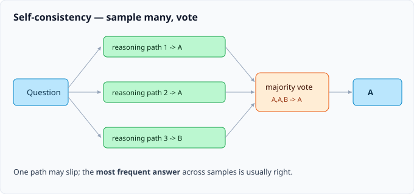

---

## Загальне порівняння

| Алгоритм | Тип | Збіг за | Швидкість | Найкраще для |
| :--- | :--- | :--- | :--- | :--- |
| Векторний kNN | пошук | зміст | середня | семантична повнота |
| HNSW / IVF / PQ | індекс | зміст | швидко | масштабування векторного пошуку |
| BM25 | пошук | точні терміни | швидко | ID, коди, назви |
| Гібридний (RRF) | злиття | обидва | швидко | загального призначення RAG |
| Переранжирування | ранжирування | запит+документ разом | повільно | точність для топ-N |
| CoT / ReAct / Self-consistency | промптинг | н/д | різна | міркування, агенти |
