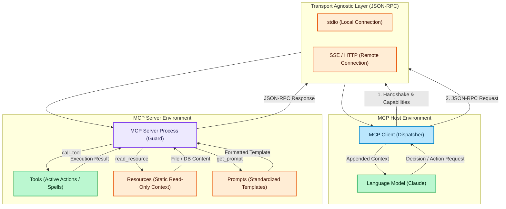

# Model Context Protocol: Best Use Cases & Architecture

---

## Overview

The Model Context Protocol (MCP) is an open standard that enables AI models to connect securely to external data sources and tools. It standardizes how AI applications interact with data, eliminating the need for custom integrations for every data source.

---

## Best Use Cases

- **Automated Prompt Evaluation Pipelines**: Building a local MCP server that connects to a database (like PostgreSQL) to fetch test datasets and store evaluation results. The AI accesses real data without hardcoding database drivers in the evaluation scripts.
- **Scientific Research Assistants**: Creating a remote MCP server that queries academic APIs (like arXiv) via Server-Sent Events (SSE). The AI can dynamically search for articles, read their content, and simplify complex topics for the user.
- **Internal Documentation Chatbots**: Integrating an MCP server with company knowledge bases like GitHub or Confluence. The AI can read internal architectural guidelines as static resources and query the latest code repositories, helping onboard new developers efficiently.
- **Dynamic File System Management**: Using local tools to read, edit, and analyze files securely on the user's machine, allowing the LLM to act as a coding assistant directly within the IDE or CLI.

---

## Core Concepts & Transport Agnostic Communication

One of the most critical features of MCP is **Transport Agnostic Communication**. This means that the core message format (JSON-RPC) remains completely identical regardless of the delivery mechanism.

- The Client and Server do not need to change their internal logic if the transport method changes.
- If the server is local, the Client uses **stdio** (standard input/output streams).
- If the server is remote, the Client uses **SSE** (Server-Sent Events over HTTP).

Before any commands are executed, the Client and Server always perform an initial **Handshake** to verify protocol versions and declare their capabilities (e.g., whether the server supports tools or resources).

---

## MCP Architecture Workflow

## Legend

| Color | Meaning |
| :--- | :--- |
| 🔵 Blue | Client / UI layer |
| 🟣 Purple | Server / infrastructure |
| 🟢 Green | Logic / services / actions |
| 🟠 Orange | State / cache / transport / data |

---

## Glossary

- **MCP Host**: The main application running the AI model (e.g., Claude Desktop, custom CLI chat) that initiates connections to MCP servers.
- **MCP Client**: An intermediate component inside the Host that manages the transport layer, handles the lifecycle of the connection, and dispatches JSON-RPC requests to the Server. It does not execute tools itself.
- **MCP Server**: A lightweight, standalone service that securely exposes specific capabilities (Tools, Resources, Prompts) and executes code locally when requested by a connected client.
- **Transport Agnostic Communication**: The principle that the JSON-RPC message structure remains exactly the same whether delivered via local processes (`stdio`) or internet protocols (`SSE`).
- **Handshake**: The initial initialization phase where the Client and Server verify protocol versions and exchange their available capabilities.
- **Tools**: Executable functions defined on the server that allow the LLM to perform active tasks (e.g., fetching API data, writing files, updating databases). They are dynamic and require arguments.
- **Resources**: Read-only data endpoints provided by the server (e.g., log files, database schemas, internal documentation). They provide static or semi-static context to the LLM without performing actions.
- **Prompts**: Reusable, server-side message templates that guide the LLM's behavior. They centralize instruction logic on the server, ensuring consistent behavior across different clients.
- **Server Inspector**: An official interactive web utility used for debugging and testing an MCP Server locally, allowing developers to manually execute tools and read resources without an LLM.
- **JSON-RPC 2.0**: The underlying standard protocol used for all communication and message formatting between the MCP Client and Server.
- **stdio**: Standard input/output transport, used when the MCP Server runs locally on the same machine as the Host.
- **SSE (Server-Sent Events)**: Transport used for connecting to remote MCP servers over HTTP/internet.
