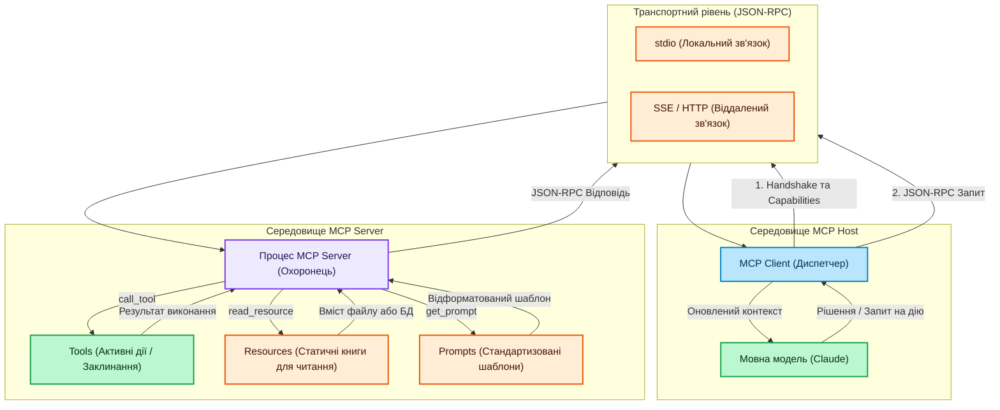

# Model Context Protocol: Найкращі сценарії використання та Архітектура

---

## Огляд

Model Context Protocol (MCP) — це відкритий стандарт, який дозволяє AI-моделям безпечно підключатися до зовнішніх джерел даних та інструментів. Він стандартизує взаємодію ШІ з даними, усуваючи необхідність писати кастомні інтеграції для кожної бази даних чи API.

---

## Найкращі сценарії використання

- **Автоматизовані конвеєри оцінювання промптів (Eval Pipelines)**: Створення локального MCP-сервера, який підключається до бази даних (наприклад, PostgreSQL) для отримання тестових наборів даних. AI отримує реальні дані через сервер, не вимагаючи жорсткого кодування логіки бази даних у скриптах оцінювання.
- **Наукові асистенти-дослідники**: Створення віддаленого MCP-сервера, який опитує академічні API (наприклад, arXiv) через Server-Sent Events (SSE). ШІ може динамічно шукати статті, читати їх зміст та пояснювати складні теми користувачеві простою мовою.
- **Внутрішні документаційні боти**: Інтеграція MCP-сервера з корпоративними базами знань, такими як GitHub або Confluence. ШІ може зчитувати внутрішні архітектурні гайдлайни як статичні ресурси, допомагаючи новим розробникам швидко адаптуватися до проекту.
- **Динамічне управління файловою системою**: Використання локальних інструментів для читання, редагування та аналізу файлів безпосередньо на комп'ютері користувача, що перетворює LLM на повноцінного помічника програміста в CLI або IDE.

---

## Ключові концепції та Незалежність від транспорту

Однією з найважливіших особливостей MCP є **Transport Agnostic Communication (Незалежність від транспорту)**. Це означає, що базовий формат повідомлень (JSON-RPC) залишається абсолютно ідентичним, незалежно від способу доставки.

- Клієнту та Серверу не потрібно змінювати свою внутрішню логіку при зміні транспорту.
- Якщо сервер локальний, Клієнт використовує **stdio** (стандартні потоки вводу/виводу).
- Якщо сервер віддалений, Клієнт використовує **SSE** (Server-Sent Events через HTTP).

Перед виконанням будь-яких команд, Клієнт і Сервер завжди здійснюють **Handshake (Рукостискання)** для перевірки версій протоколу та узгодження можливостей (capabilities), наприклад, чи підтримує сервер інструменти або ресурси.

---

## Архітектура та принципи роботи MCP

## Легенда

| Колір | Значення |
| :--- | :--- |
| 🔵 Синій | Клієнт / рівень інтерфейсу (Client / UI) |
| 🟣 Фіолетовий | Сервер / інфраструктура (Server / Infrastructure) |
| 🟢 Зелений | Логіка / сервіси / дії (Logic / Services / Actions) |
| 🟠 Помаранчевий | Стан / кеш / транспорт / дані (State / Data) |

---

## Глосарій

- **MCP Host**: Основна програма, що запускає AI-модель (наприклад, Claude Desktop, Cursor), яка ініціює підключення до серверів.
- **MCP Client**: Проміжний компонент всередині Host, який керує транспортним рівнем, підтримує життєвий цикл з'єднання та надсилає JSON-RPC запити до сервера. Він самостійно не виконує інструменти.
- **MCP Server**: Легкий автономний сервіс, що безпечно надає специфічні можливості (Інструменти, Ресурси, Промпти) та локально виконує код за запитом клієнта.
- **Transport Agnostic Communication (Незалежність від транспорту)**: Принцип, за яким структура JSON-RPC повідомлень залишається незмінною, незалежно від того, як вони доставляються (локально через `stdio` чи віддалено через `SSE`).
- **Handshake (Рукостискання)**: Початкова фаза з'єднання, під час якої Клієнт та Сервер звіряють версії протоколу та обмінюються своїми можливостями (capabilities).
- **Tools (Інструменти)**: Виконувані функції на стороні сервера, які дозволяють LLM виконувати активні завдання (наприклад, пошук в API, редагування файлів). Вони динамічні та приймають аргументи.
- **Resources (Ресурси)**: Дані "лише для читання", які сервер надає через унікальні URI (наприклад, логи, схеми БД). Вони постачають статичний контекст без виконання побічних дій.
- **Prompts (Промпти)**: Багаторазові шаблони повідомлень, які централізують інструкції на сервері, гарантуючи однакову поведінку ШІ для різних клієнтів.
- **Server Inspector**: Офіційна веб-утиліта для локального тестування та зневадження (debugging) MCP-сервера без використання LLM.
- **JSON-RPC 2.0**: Базовий стандартний протокол для форматування повідомлень між Клієнтом і Сервером.
- **stdio**: Стандартний ввід/вивід (standard input/output). Використовується для локальних серверів, запущених на тому ж комп'ютері, що й Host.
- **SSE (Server-Sent Events)**: Транспортний протокол для підключення до віддалених серверів через HTTP/інтернет.
